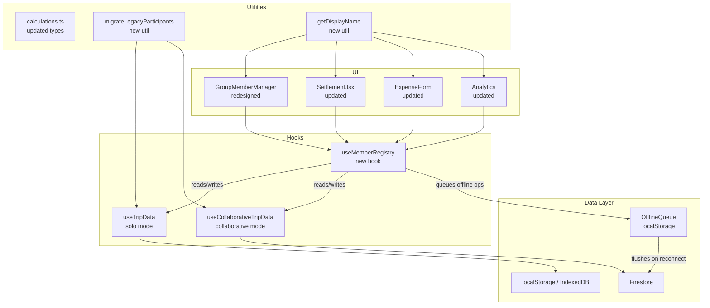
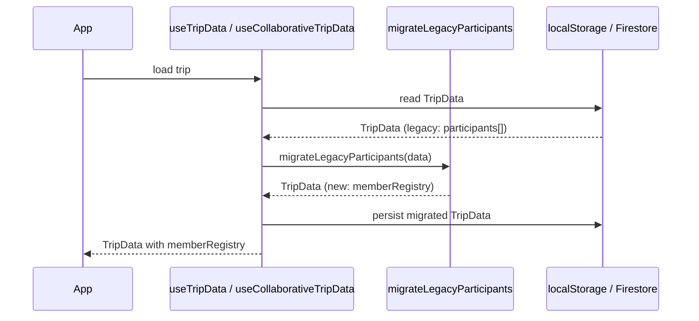

# Design Document: Member Management

## Overview

The Member Management feature replaces TripSpend's fragile name-string participant model with a stable UUID-based identity system. Today, `TripSetup.participants: string[]` is the single source of truth for who is in a trip, and every expense field (`paidBy`, `participants[]`) and settlement field (`from`, `to`) stores a raw name string. This means renaming a member silently breaks historical references, duplicate names cause logic errors, and there is no stable cross-session identity in collaborative mode.

The redesign introduces:

- `MemberRecord` — a stable `{ memberId, name, isActive, joinedAt, leftAt?, color? }` object per participant.
- `MemberRegistry` — a `Record<memberId, MemberRecord>` map stored in `TripSetup.memberRegistry`, replacing `participants[]`.
- Updated `Expense` and settlement types that reference `memberId` instead of name strings.
- A one-time idempotent migration from the legacy format.
- A `useMemberRegistry` hook encapsulating all CRUD, soft-delete, restore, and offline-queue logic.
- Updated `identityMap` (`uid → memberId` instead of `uid → name`).
- Updated `Settlement.tsx` using `memberId`-based identity resolution and `fromMemberActive`/`toMemberActive` denormalization.
- A redesigned `GroupMemberManager.tsx` with add/rename/soft-delete/restore, claimed-name locking, and disambiguation labels.

The feature works in both solo (IndexedDB/localStorage) and collaborative (Firestore real-time) modes.

---

## Architecture

### Component and Data Flow



### Key Design Decisions

1. **`memberRegistry` lives inside `TripSetup`** — keeps the existing single-document Firestore trip model intact. No new top-level collection needed.
2. **`useMemberRegistry` is a thin orchestration hook** — it delegates persistence to the existing `useTripData` / `useCollaborativeTripData` hooks via a `saveSetup` callback, keeping storage concerns in one place.
3. **Migration runs at read time, writes once** — when the app loads a trip with `participants[]` and no `memberRegistry`, it migrates in memory and persists the result. Subsequent loads detect `memberRegistry` and skip migration.
4. **`identityMap` changes from `uid → name` to `uid → memberId`** — a Firestore transaction enforces uniqueness in both directions (one uid per memberId, one memberId per uid).
5. **`fromMemberActive` / `toMemberActive` are denormalized onto settlement documents** — Firestore rules cannot iterate nested maps, so the client writes these flags and the rules read them directly. The existing 7-path rule model already uses this pattern.
6. **Disambiguation is computed at render time** — `getDisplayName(memberId, registry)` returns `name` when unique, `"name #N"` when duplicated. No disambiguation state is stored.

---

## Components and Interfaces

### `useMemberRegistry` Hook

The central hook for all member CRUD. It wraps the existing `saveSetup` from either `useTripData` or `useCollaborativeTripData`.

```typescript
interface UseMemberRegistryInput {
  setup: TripSetup | null;
  saveSetup: (setup: TripSetup) => void | Promise<void>;
  isCollaborative: boolean;
  userUid: string | null;
  tripCreatorUid: string | null;
  identityMap: Record<string, string>; // uid → memberId
}

interface UseMemberRegistryOutput {
  // Derived state
  members: MemberRecord[];           // all members (active + inactive), sorted by joinedAt
  activeMembers: MemberRecord[];     // isActive === true only
  registry: MemberRegistry;

  // CRUD
  addMember(name: string): Promise<MemberRecord>;
  renameMember(memberId: string, newName: string): Promise<void>;
  removeMember(memberId: string): Promise<void>;   // soft delete
  restoreMember(memberId: string): Promise<void>;

  // Identity
  getDisplayName(memberId: string): string;        // with disambiguation suffix if needed
  getMemberById(memberId: string): MemberRecord | undefined;

  // Permissions
  canRename(memberId: string): boolean;
  canRemove(memberId: string): boolean;

  // Migration
  isMigrated: boolean;
}
```

### `getDisplayName` Utility

```typescript
// src/utils/memberDisplay.ts

/**
 * Returns the display name for a member, appending " #N" when two or more
 * active members share the same name. The suffix is 1-indexed by join order.
 *
 * Examples:
 *   - unique name  → "Alice"
 *   - first dupe   → "Alex #1"
 *   - second dupe  → "Alex #2"
 */
export function getDisplayName(
  memberId: string,
  registry: MemberRegistry,
  includeInactive?: boolean
): string;

/**
 * Returns a map of memberId → display name for all members in the registry.
 * Cheap to compute once and pass down as a prop.
 */
export function buildDisplayNameMap(
  registry: MemberRegistry,
  includeInactive?: boolean
): Record<string, string>;
```

### Updated `GroupMemberManager` Props

```typescript
interface GroupMemberManagerProps {
  setup: TripSetup;
  onUpdate: (setup: TripSetup) => void | Promise<void>;
  isCollaborative: boolean;
  userUid: string | null;
  tripCreatorUid: string | null;
  identityMap: Record<string, string>; // uid → memberId
}
```

### Updated `Settlement` Props

```typescript
interface SettlementProps {
  data: TripData;
  tripId?: string | null;
  userUid?: string | null;
  userDisplayName?: string | null;
  userEmail?: string | null;
  isCollaborative?: boolean;
  // myParticipantName removed — replaced by memberId resolution via identityMap
  identityMap?: Record<string, string>; // uid → memberId
  tripCreatorUid?: string | null;
}
```

### `OfflineQueue`

```typescript
// src/utils/offlineQueue.ts

type MemberOp =
  | { type: 'add';     memberId: string; name: string;    timestamp: string }
  | { type: 'rename';  memberId: string; newName: string; timestamp: string }
  | { type: 'remove';  memberId: string;                  timestamp: string }
  | { type: 'restore'; memberId: string;                  timestamp: string };

interface OfflineQueue {
  tripId: string;
  ops: MemberOp[];
}

export function enqueueOp(tripId: string, op: MemberOp): void;
export function dequeueAll(tripId: string): MemberOp[];
export function clearQueue(tripId: string): void;
```

---

## Data Models

### `MemberRecord`

```typescript
// src/utils/calculations.ts  (added)

export interface MemberRecord {
  memberId: string;    // UUID, immutable, generated once at creation
  name: string;        // mutable display name, 1–50 chars after trim
  isActive: boolean;   // false = soft-deleted
  joinedAt: string;    // ISO timestamp, set at creation, immutable
  leftAt?: string;     // ISO timestamp, set on soft-delete, cleared on restore
  color?: string;      // optional hex or Tailwind token for avatar badge
}
```

### `MemberRegistry`

```typescript
export type MemberRegistry = Record<string, MemberRecord>; // keyed by memberId
```

### Updated `TripSetup`

```typescript
export interface TripSetup {
  // --- existing fields (unchanged) ---
  peopleCount: number;
  budgetPerPerson: number;
  totalBudget: number;
  startDate: string;
  endDate: string;
  lockPreviousDays: boolean;
  participantPhoneNumbers?: Record<string, string>;
  participantUpiIds?: Record<string, string>;
  customCategories?: string[];

  // --- legacy (kept for migration detection, removed after migration) ---
  participants?: string[];

  // --- new ---
  memberRegistry?: MemberRegistry;
}
```

### Updated `Expense`

```typescript
export interface Expense {
  // --- existing fields (unchanged) ---
  id: string;
  amount: number;
  category: string;
  note?: string;
  date: string;
  tags?: string[];
  receipts?: Array<{ image: string; name?: string }>;
  receiptImage?: string;
  receiptName?: string;
  ocrText?: string;
  isAiCategorized?: boolean;
  createdAt?: string;
  updatedAt?: string;

  // --- updated: now stores memberId (was name string) ---
  paidBy: string;          // memberId
  participants?: string[]; // memberId[]
  splitType?: 'equal' | 'custom';
  splitMap?: Record<string, number>; // memberId → amount
}
```

### Updated `SettlementTransfer`

```typescript
export interface SettlementTransfer {
  from: string;   // memberId (was name)
  to: string;     // memberId (was name)
  amount: number;
}
```

### Firestore Settlement Document (updated fields)

```typescript
// /trips/{tripId}/settlements/{settlementId}
interface FirestoreSettlementDoc {
  from: string;              // memberId (immutable after create)
  to: string;                // memberId (immutable after create)
  amount: number;            // immutable after create
  fromUserId: string | null; // Firebase uid of sender (set on create)
  toUserId: string | null;   // Firebase uid of receiver (set on Path 3 confirm)
  status: 'pending' | 'paid' | 'completed';
  fromMemberActive: boolean; // denormalized from memberRegistry[from].isActive
  toMemberActive: boolean;   // denormalized from memberRegistry[to].isActive
  creatorOverride: boolean;
  creatorOverrideAt?: Timestamp;
  note?: string | null;
  proofImage?: string | null;
  proofName?: string | null;
  paidAt?: Timestamp;
  completedAt?: Timestamp;
  createdAt: Timestamp;
  updatedAt: Timestamp;
}
```

### Updated `identityMap` in Firestore Trip Document

```typescript
// /trips/{tripId}  (partial)
interface FirestoreTripDoc {
  // ... existing fields ...
  identityMap: Record<string, string>; // uid → memberId  (was uid → name)
  memberRegistry?: MemberRegistry;     // embedded in setup or at top level
}
```

> **Note:** `memberRegistry` is stored inside `TripSetup` (i.e., `trip.setup.memberRegistry`) for local trips, and inside the Firestore trip document's `setup` field for collaborative trips. This keeps the existing `setup` update path (`updateDoc(tripRef, { setup, updatedAt })`) working without schema changes.

---

## Migration Strategy

### Algorithm: `migrateLegacyParticipants`

```typescript
// src/utils/migration.ts

/**
 * Migrates a TripData from legacy participants[] format to memberRegistry.
 *
 * Idempotent: if memberRegistry already exists, returns data unchanged.
 * Rollback-safe: on any error, returns original data and logs the error.
 *
 * Steps:
 *  1. If memberRegistry exists → return data as-is (already migrated).
 *  2. Build name → MemberRecord map from participants[].
 *     - Each unique name gets a freshly generated UUID memberId.
 *     - Duplicate names each get their own UUID (no content-based hashing).
 *  3. Rewrite all expense.paidBy and expense.participants[] to memberId values.
 *  4. Rewrite all settlement from/to fields to memberId values.
 *  5. Build memberRegistry from the name → MemberRecord map.
 *  6. Return updated TripData with memberRegistry set and participants[] removed.
 */
export function migrateLegacyParticipants(data: TripData): TripData;
```

**Idempotency guarantee:** The migration checks `setup.memberRegistry` first. If it exists (even partially), the migration is skipped entirely. This means running the migration twice on the same data is safe.

**Duplicate name handling:** When `participants = ["Alex", "Alex"]`, two separate `MemberRecord` entries are created with distinct UUIDs. The name-to-memberId mapping used during migration is index-based (first "Alex" → uuid-1, second "Alex" → uuid-2), matching the original array order so expense references are rewritten correctly.

**Rollback:** The function is pure — it returns a new `TripData` object and never mutates the input. The caller (hook or screen) is responsible for persisting the result. If an exception is thrown, the caller catches it, logs it, and continues using the original data.

### Migration Trigger Points

| Mode | Where | When |
|------|-------|------|
| Solo | `useTripData.saveSetup` / initial load | On first render when `setup.participants` exists and `setup.memberRegistry` is absent |
| Collaborative | `useCollaborativeTripData` snapshot handler | When a trip snapshot arrives with `participants[]` and no `memberRegistry` |
| Solo → Collaborative import | `importLocalTrips` | Before writing each local trip to Firestore |

### Migration Sequence Diagram



---

## `useMemberRegistry` — Key Function Signatures

```typescript
// src/hooks/useMemberRegistry.ts

export function useMemberRegistry(input: UseMemberRegistryInput): UseMemberRegistryOutput {

  // addMember: generates UUID, creates MemberRecord, calls saveSetup
  async function addMember(name: string): Promise<MemberRecord>;

  // renameMember: validates permissions, updates name field only
  async function renameMember(memberId: string, newName: string): Promise<void>;

  // removeMember: sets isActive=false, leftAt=now, updates settlement denorm flags
  async function removeMember(memberId: string): Promise<void>;

  // restoreMember: sets isActive=true, clears leftAt
  async function restoreMember(memberId: string): Promise<void>;

  // getDisplayName: returns "name" or "name #N" based on duplicates
  function getDisplayName(memberId: string): string;

  // canRename: trip creator OR uid maps to this memberId
  function canRename(memberId: string): boolean;

  // canRemove: trip creator OR uid maps to this memberId; blocks last active member
  function canRemove(memberId: string): boolean;
}
```

### `removeMember` — Settlement Denormalization Update

When `removeMember` is called, after updating `memberRegistry`, the hook must also update `fromMemberActive`/`toMemberActive` on all open settlement documents that reference the removed `memberId`:

```typescript
// Pseudocode inside removeMember (collaborative mode only)
const openSettlements = await queryOpenSettlementsForMember(tripId, memberId);
const batch = writeBatch(firestore);
for (const settlDoc of openSettlements) {
  const update: Partial<FirestoreSettlementDoc> = { updatedAt: serverTimestamp() };
  if (settlDoc.from === memberId) update.fromMemberActive = false;
  if (settlDoc.to   === memberId) update.toMemberActive   = false;
  batch.update(settlDoc.ref, update);
}
// Also update memberRegistry in the trip doc
batch.update(tripRef, { 'setup.memberRegistry': updatedRegistry, updatedAt: serverTimestamp() });
await batch.commit();
```

The Firestore rules allow this because the `status` field is also changing (or the active-flag protection clause permits flag changes when status changes). Wait — the rules say flags may only change when status changes. To satisfy this, the client must include a status field in the update that equals the current status (no-op status change), OR the rules must be read more carefully.

**Re-reading the rule:** The active-flag protection says:
> if `status` is unchanged, then `fromMemberActive` and `toMemberActive` must equal their previous values.

This means the client **cannot** update only the active flags without also changing status. The solution is to write the active-flag update as part of a status transition, or to use a separate admin path. Since the existing rules don't have a standalone "update active flags" path, the design uses the following approach:

**Active-flag update strategy:** The client writes `fromMemberActive: false` (or `toMemberActive: false`) **only when the settlement status is also transitioning** (e.g., as part of Path 5/6/7 creator fallback). For the case where a member is removed while settlements are still `pending`, the client cannot update the flags directly under the current rules.

**Resolution:** The Firestore rules need a new Path 0 — "member status update" — that allows the trip creator to update `fromMemberActive`/`toMemberActive` without changing `status`, provided `creatorOverride: true` and the creator is the writer. This is a targeted rules addition that does not break any existing paths.

Alternatively (simpler): the client reads `fromMemberActive`/`toMemberActive` from the settlement document at query time by looking up the member's current `isActive` from `memberRegistry` in memory, rather than relying on the denormalized field being up-to-date. The denormalized field is only used by Firestore rules (which cannot read `memberRegistry`). The client always has the live registry.

**Final approach adopted:** The client updates `fromMemberActive`/`toMemberActive` on settlement documents as part of the same batch that updates `memberRegistry`. The Firestore rules need a dedicated **Path 0** — a flag-only update path gated strictly on `isTripCreator(tripId)`, where `status` is unchanged and only `fromMemberActive`/`toMemberActive` (and `updatedAt`) may change. `creatorOverride` must remain `false` on Path 0 writes — this is a maintenance operation, not a settlement action.

### Path 0 — Flag-Only Update (Trip Creator)

```
Path 0 conditions:
  - isTripCreator(tripId)
  - resource.data.status == request.resource.data.status  (status unchanged)
  - Only fromMemberActive, toMemberActive, updatedAt may differ from previous values
  - creatorOverride must remain false (this is not a settlement action)
  - Immutable fields (from, to, amount, fromUserId) unchanged
```

This path is narrow by design — it cannot be used to change status, set `creatorOverride`, or modify any financial field. It exists solely to propagate member `isActive` changes to settlement documents.

### Rule Logical Structure (critical)

The `allow update` block uses the following logical structure. The grouping is intentional and must be preserved exactly:

```
allow update: if isTripMember(tripId)
  && <immutable fields unchanged>
  && (
    Path 0                          // flag-only, no status change
    ||
    (
      active-flag-protection        // flags only change when status changes
      && (
        Path 1 || Path 2 || Path 3 || Path 4 || Path 5 || Path 6 || Path 7
      )
    )
  );
```

**Why this grouping matters:** The active-flag protection must be `&&`-ed with the transition paths inside a single nested block — NOT as a sibling `||` of Path 0. If the active-flag protection were a sibling `||` of Path 0, it would be evaluated independently and could allow writes that satisfy the flag condition alone without matching any valid transition path. The correct structure ensures: either the write is a Path 0 flag-only update, OR it is a transition write that satisfies both the flag protection AND one of the 7 transition paths.

### `removeMember` — Settlement Denormalization Update (with batch chunking)

When `removeMember` is called, the hook queries all open settlement documents referencing the removed `memberId` and updates their active flags via Path 0. To avoid hitting Firestore's 500-operation batch limit, updates are chunked:

```typescript
// Pseudocode inside removeMember (collaborative mode only)
const CHUNK_SIZE = 100;
const openSettlements = await queryOpenSettlementsForMember(tripId, memberId);

// Chunk the settlement updates to stay within Firestore batch limits
for (let i = 0; i < openSettlements.length; i += CHUNK_SIZE) {
  const chunk = openSettlements.slice(i, i + CHUNK_SIZE);
  const batch = writeBatch(firestore);

  for (const settlDoc of chunk) {
    const update: Partial<FirestoreSettlementDoc> = { updatedAt: serverTimestamp() };
    if (settlDoc.from === memberId) update.fromMemberActive = false;
    if (settlDoc.to   === memberId) update.toMemberActive   = false;
    batch.update(settlDoc.ref, update);
  }

  // Include memberRegistry update only in the first chunk
  if (i === 0) {
    batch.update(tripRef, {
      'setup.memberRegistry': updatedRegistry,
      updatedAt: serverTimestamp(),
    });
  }

  await batch.commit();
}
```

**Chunk size rationale:** 100 operations per batch leaves headroom for the `memberRegistry` update and any concurrent writes. At 100 settlements per batch, a trip with 500 open settlements requires 5 sequential batch commits — acceptable latency for a rare operation (member removal).

---

## Updated `useCollaborativeTripData`

### `identityMap` Change: `uid → memberId`

The existing `claimParticipantIdentity` function writes `identityMap[uid] = participantName`. This must change to write `identityMap[uid] = memberId`.

```typescript
// Updated signature
const claimMemberIdentity = useCallback(async (
  tripId: string,
  memberId: string
): Promise<boolean> => {
  // Uses a Firestore transaction to enforce:
  // 1. uid does not already have a mapping (forward uniqueness)
  // 2. memberId is not already claimed by another uid (reverse uniqueness)
  const tripRef = doc(firestore, 'trips', tripId);
  return runTransaction(firestore, async (tx) => {
    const snap = await tx.get(tripRef);
    const map = (snap.data()?.identityMap ?? {}) as Record<string, string>;

    // Forward check: uid already mapped?
    if (map[userUid] !== undefined) throw new Error('uid_already_mapped');

    // Reverse check: memberId already claimed?
    const alreadyClaimed = Object.values(map).includes(memberId);
    if (alreadyClaimed) throw new Error('memberId_already_claimed');

    tx.update(tripRef, {
      [`identityMap.${userUid}`]: memberId,
      updatedAt: serverTimestamp(),
    });
    return true;
  });
}, [enabled, userUid]);
```

### `myMemberId` Derived Value

```typescript
// Replaces myParticipantName
const myMemberId = useMemo(() => {
  if (!userUid) return null;
  return identityMap[userUid] ?? null;
}, [identityMap, userUid]);
```

### `memberRegistry` in Snapshot Handler

The snapshot handler in `useCollaborativeTripData` already reads `tripPayload.setup` as `TripSetup`. Since `memberRegistry` is stored inside `setup`, it arrives automatically. No additional listener is needed.

---

## Updated `Settlement.tsx`

### Identity Resolution

Replace the name-string `identitySet` with `memberId`-based checks:

```typescript
// OLD
const identitySet = useMemo(() => {
  const values = new Set<string>();
  add(myParticipantName);
  add(userDisplayName);
  add(userEmail);
  return values;
}, [myParticipantName, userDisplayName, userEmail]);

const isSender   = (from: string) => identitySet.has(from.trim().toLowerCase());
const isReceiver = (to: string)   => identitySet.has(to.trim().toLowerCase());

// NEW
const myMemberId = useMemo(() => {
  if (!userUid || !identityMap) return null;
  return identityMap[userUid] ?? null;
}, [userUid, identityMap]);

const isSender   = useCallback((from: string) => {
  if (!collaborativeEnabled) return false;
  return myMemberId === from;
}, [collaborativeEnabled, myMemberId]);

const isReceiver = useCallback((to: string) => {
  if (!collaborativeEnabled) return true;
  return myMemberId === to;
}, [collaborativeEnabled, myMemberId]);
```

### Display Names in Settlement UI

All places that render `transfer.from` / `transfer.to` / `person` (balance list) must go through `getDisplayName`:

```typescript
const displayNames = useMemo(
  () => buildDisplayNameMap(data.setup?.memberRegistry ?? {}, true /* include inactive */),
  [data.setup?.memberRegistry]
);

// Usage: displayNames[transfer.from] ?? transfer.from
```

### Creator Fallback UI

When `collaborativeEnabled` and the current user is the trip creator, show fallback action buttons for transfers where `fromMemberActive === false` or `toMemberActive === false`:

```typescript
const isCreator = userUid === tripCreatorUid;

// In pending transfer row:
{isCreator && !isSender(transfer.from) && fromMemberInactive && (
  <button onClick={() => openCreatorFallbackPaid(transfer)}>
    Mark paid (on behalf)
  </button>
)}
```

The `fromMemberActive` / `toMemberActive` values are read from the Firestore settlement document snapshot (already in `paidMap` / `settledMap`), not from `memberRegistry` directly, to stay consistent with what the rules enforce.

### Inactive Member Visual Indicator

```typescript
// In balance list and transfer rows:
const memberRecord = registry[person];
const isInactive = memberRecord && !memberRecord.isActive;

<span className={isInactive ? 'text-slate-400 line-through' : ''}>
  {displayNames[person]}
</span>
{isInactive && <span className="text-[10px] text-slate-400 ml-1">left</span>}
```

---

## Updated `GroupMemberManager.tsx`

### New UI Sections

1. **Active members list** — add / rename / soft-delete. Claimed members show a lock icon; only the owner or creator can rename.
2. **Inactive members list** (collapsible) — shows soft-deleted members with a "Restore" button.
3. **Add member input** — same as current but now writes to `memberRegistry`.
4. **Disambiguation labels** — rendered via `getDisplayName`.

### Rename Permission Check

```typescript
function canRename(memberId: string): boolean {
  if (!isCollaborative) return true;
  if (userUid === tripCreatorUid) return true;
  return identityMap[userUid ?? ''] === memberId;
}
```

### Remove Guard

```typescript
function canRemove(memberId: string): boolean {
  if (activeMembers.length <= 1) return false; // last active member
  if (!isCollaborative) return true;
  if (userUid === tripCreatorUid) return true;
  return identityMap[userUid ?? ''] === memberId;
}
```

### Balance Warning Before Remove

Before confirming soft-delete, the component queries `calculateSettlement` with the current data and checks if the member has a non-zero balance or pending transfers. If so, it shows a confirmation dialog with the balance amount and pending transfer count.

---

## Disambiguation

### Algorithm

`getDisplayName(memberId, registry, includeInactive?)`:

1. Look up `record = registry[memberId]`. If not found, return `memberId` (fallback).
2. Collect all records with `record.name === name` (filtered by `includeInactive` flag).
3. If only one record has this name → return `name`.
4. Sort duplicates by `joinedAt` ascending (stable, deterministic).
5. Find the 1-based index of `memberId` in the sorted list → return `"name #N"`.

This is O(n) per call but n ≤ 20 (MAX_PEOPLE), so it's negligible. `buildDisplayNameMap` runs it once for all members and memoizes the result.

### Suffix Stability on Restore

The join-order suffix (`#N`) is derived from `joinedAt` timestamps, which are immutable. Restoring a soft-deleted member does not change their `joinedAt`, so their suffix is stable across remove/restore cycles. If member "Alex" (joined first) is removed and later restored, they will still be "Alex #1" — the suffix does not shift.

**Optional future improvement:** Store a `disambiguationIndex` field on `MemberRecord` at creation time. This would make the suffix completely independent of sort order and immune to any future changes in the disambiguation algorithm. Not required for the initial implementation.

### Consistency Guarantee

All screens receive the same `registry` object (from `data.setup.memberRegistry`), so `buildDisplayNameMap` produces identical results everywhere within a session. No disambiguation state is stored or synchronized.

---

## Offline Conflict Resolution

### Last-Write-Wins for Renames

Each member operation in the `OfflineQueue` carries a local `timestamp` (ISO string). When the queue is flushed on reconnect, operations are applied in timestamp order. If two collaborators renamed the same `memberId` while offline, the one with the later timestamp wins.

The flush logic reads the current Firestore `memberRegistry`, applies queued ops in order, and writes the result in a single `updateDoc`. If the Firestore write fails due to a concurrent update, it retries with exponential backoff (max 3 retries).

### Op Precedence Rules

When multiple queued operations target the same `memberId`, the following precedence rules apply before flushing:

| Conflict | Resolution |
|----------|-----------|
| `rename` vs `rename` (same memberId) | Later timestamp wins |
| `remove` vs `rename` (same memberId) | `remove` always wins, regardless of timestamp |
| `restore` vs `rename` (same memberId) | `restore` wins, then rename is applied on top |
| `remove` vs `restore` (same memberId) | Later timestamp wins |

The rationale for `remove` beating `rename`: a rename is a cosmetic change; a remove is a structural decision. If one collaborator removed a member and another renamed them while offline, the removal intent takes precedence. The rename is silently discarded.

### Conflict Notification

After flushing, if any rename was overridden (the local value differs from the Firestore value after flush), the hook emits a `conflictNotification` state value:

```typescript
interface ConflictNotification {
  memberId: string;
  localName: string;    // what the local user had
  winningName: string;  // what Firestore has after flush
  winnerUid?: string;   // uid of the collaborator who won (from updatedBy field)
}
```

The UI renders this as a non-blocking toast: `"Alex's name was updated by another member"`.

### Concurrent Add (Same Name)

Two collaborators adding a member with the same name while offline produces two separate `MemberRecord` entries with distinct UUIDs. This is correct behavior per Requirement 10.4. The disambiguation label will distinguish them.

---

## Error Handling

| Scenario | Behavior |
|----------|----------|
| Migration fails (exception) | Catch, log error, return original `TripData` unchanged. App continues in legacy mode for this trip. |
| `addMember` with empty/too-long name | Validate before write; return descriptive error string to UI. |
| `renameMember` permission denied | Return `'permission_denied'` error; UI shows toast. |
| `removeMember` on last active member | Return `'last_member'` error; UI shows inline message. |
| `claimMemberIdentity` uid already mapped | Return `'uid_already_mapped'`; UI prompts user to restore existing membership. |
| `claimMemberIdentity` memberId already claimed | Return `'memberId_already_claimed'`; UI shows "this slot is taken" message. |
| Firestore write failure (offline) | Enqueue op to `OfflineQueue`; show offline indicator. |
| Settlement denorm update batch failure | Log error; settlement flags may be stale until next sync. Creator fallback UI falls back to reading `memberRegistry` directly. |
| Conflict notification display | Non-blocking toast, auto-dismisses after 5 seconds. |

---

## Testing Strategy

### Unit Tests

- `migrateLegacyParticipants`: test with zero participants, one participant, duplicate names, already-migrated data (idempotency), and exception path (rollback).
- `getDisplayName` / `buildDisplayNameMap`: test unique names, duplicate names, inactive members, empty registry.
- `useMemberRegistry` (via React Testing Library): add, rename, remove, restore, permission checks, last-member guard.
- `calculateSettlement` with `memberId`-keyed data: verify balances and transfers use memberIds correctly.
- `OfflineQueue`: enqueue, dequeue, clear, ordering.

### Property-Based Tests

See Correctness Properties section below.

### Integration Tests

- `claimMemberIdentity` transaction: verify forward and reverse uniqueness under concurrent writes (use Firestore emulator).
- Settlement denorm batch: verify `fromMemberActive`/`toMemberActive` are updated correctly when a member is removed.
- Firestore rules: verify all 7 settlement paths accept/reject correctly with the new `memberId`-based fields.

### Smoke Tests

- App loads a legacy trip → migration runs → `memberRegistry` is present → no crash.
- App loads an already-migrated trip → migration is skipped → data unchanged.

---

## Correctness Properties

*A property is a characteristic or behavior that should hold true across all valid executions of a system — essentially, a formal statement about what the system should do. Properties serve as the bridge between human-readable specifications and machine-verifiable correctness guarantees.*


### Property 1: Member ID stability through mutations

*For any* `MemberRecord` created by `addMember`, after any sequence of `renameMember`, `removeMember`, and `restoreMember` operations on that record, the `memberId` field must equal the value assigned at creation time.

**Validates: Requirements 1.1, 1.3, 3.1**

---

### Property 2: New member record shape

*For any* valid name string (1–50 characters after trim), `addMember(name)` must return a `MemberRecord` where `memberId` is a non-empty string, `name` equals the trimmed input, `isActive` is `true`, `joinedAt` is a valid ISO timestamp, and `leftAt` is `undefined`.

**Validates: Requirements 1.2, 2.1**

---

### Property 3: Duplicate names produce distinct member IDs

*For any* name string, calling `addMember(name)` twice on the same registry must produce two `MemberRecord` entries with distinct `memberId` values, and both must be present in the registry.

**Validates: Requirements 1.5, 2.4**

---

### Property 4: Rename preserves all fields except name

*For any* `MemberRecord` and any valid new name string, after `renameMember(memberId, newName)`, the record in the registry must have `name === newName` and all other fields (`memberId`, `isActive`, `joinedAt`, `leftAt`, `color`) must be identical to their pre-rename values.

**Validates: Requirements 1.3, 3.1**

---

### Property 5: Member lifecycle operations never modify expenses

*For any* `TripData` and any sequence of `addMember`, `renameMember`, `removeMember`, and `restoreMember` operations, the `expenses` array must be identical (same length, same field values) before and after the operations.

**Validates: Requirements 4.2, 5.2**

---

### Property 6: Name validation boundary

*For any* string of length 0 after trim, or length > 50 after trim, both `addMember` and `renameMember` must return a validation error and leave the registry unchanged. *For any* string of length 1–50 after trim, both operations must succeed.

**Validates: Requirements 2.2, 2.3, 3.2**

---

### Property 7: Soft-delete sets isActive false and records leftAt

*For any* active `MemberRecord`, after `removeMember(memberId)`, the record in the registry must have `isActive === false` and `leftAt` must be a valid ISO timestamp string.

**Validates: Requirements 4.1**

---

### Property 8: Last active member cannot be removed

*For any* `MemberRegistry` containing exactly one active member, `canRemove(thatMemberId)` must return `false`.

**Validates: Requirements 4.6**

---

### Property 9: Remove-then-restore round trip

*For any* active `MemberRecord`, after `removeMember(memberId)` followed by `restoreMember(memberId)`, the record must have `isActive === true`, `leftAt === undefined`, and all other fields identical to their pre-remove values.

**Validates: Requirements 5.1, 5.3**

---

### Property 10: Inactive members remain visible in settlement calculation

*For any* `TripData` where a member has been soft-deleted but has a non-zero balance or is referenced in transfers, `calculateSettlement` must include that member's balance in `balances` and their transfers in `transfers` — the inactive status must not cause any entry to be omitted.

**Validates: Requirements 6.1, 6.2**

---

### Property 11: Settlement documents include active-flag fields

*For any* settlement document created by the client, the document must include `fromMemberActive` and `toMemberActive` boolean fields that match the `isActive` values of the corresponding members in `memberRegistry` at the time of creation.

**Validates: Requirements 6.5**

---

### Property 12: Rename permission — non-owner non-creator is rejected

*For any* claimed `memberId` (i.e., some uid maps to it in `identityMap`), and any `userUid` that is neither the trip creator nor the uid mapped to that `memberId`, `canRename(memberId)` must return `false`.

**Validates: Requirements 3.3, 4.7, 8.2, 8.3, 8.5**

---

### Property 13: Identity map forward uniqueness

*For any* `uid` that already has an entry in `identityMap`, a subsequent call to `claimMemberIdentity(tripId, anyMemberId)` with that same `uid` must fail with `'uid_already_mapped'` and leave `identityMap` unchanged.

**Validates: Requirements 7.3**

---

### Property 14: Identity map reverse uniqueness

*For any* `memberId` that is already a value in `identityMap`, a call to `claimMemberIdentity(tripId, memberId)` from a different `uid` must fail with `'memberId_already_claimed'` and leave `identityMap` unchanged.

**Validates: Requirements 7.4**

---

### Property 15: Observer has no send/receive permissions

*For any* `userUid` that has no entry in `identityMap`, `isSender(anyMemberId)` and `isReceiver(anyMemberId)` must both return `false` in collaborative mode.

**Validates: Requirements 7.5**

---

### Property 16: memberId-based identity distinguishes same-name members

*For any* two members with identical `name` values but distinct `memberId` values, `isSender` and `isReceiver` must return `true` only for the member whose `memberId` matches `identityMap[userUid]`, and `false` for the other — regardless of name equality.

**Validates: Requirements 7.7**

---

### Property 17: Disambiguation labels are stable and distinct

*For any* `MemberRegistry` where two or more active members share the same `name`, `buildDisplayNameMap` must return distinct display strings for each of those members, and calling `buildDisplayNameMap` multiple times on the same registry must return identical results.

**Validates: Requirements 1.6, 9.1, 9.2, 9.5**

---

### Property 18: Disambiguation label removed after rename makes name unique

*For any* `MemberRegistry` where member A and member B share a name, after renaming member A to a name not shared by any other active member, `getDisplayName(memberA_id, updatedRegistry)` must return the new name without any suffix.

**Validates: Requirements 9.4**

---

### Property 19: Migration produces one registry entry per participant

*For any* `TripData` with `participants: string[]` of length N and no `memberRegistry`, `migrateLegacyParticipants(data)` must produce a `memberRegistry` with exactly N entries, each with a distinct `memberId`.

**Validates: Requirements 11.1**

---

### Property 20: Migration is idempotent

*For any* `TripData`, `migrateLegacyParticipants(migrateLegacyParticipants(data))` must produce a result structurally equal to `migrateLegacyParticipants(data)` — running migration twice must have the same effect as running it once.

**Validates: Requirements 11.2, 11.5**

---

### Property 21: Migration reference validity

*For any* migrated `TripData`, every `expense.paidBy`, every element of `expense.participants[]`, and every `settlement.from` and `settlement.to` value must be a key present in `setup.memberRegistry`.

**Validates: Requirements 11.3, 11.4**

---

### Property 22: Migration removes legacy participants array

*For any* `TripData` with a non-empty `participants[]`, after `migrateLegacyParticipants`, `setup.participants` must be `undefined` and `setup.memberRegistry` must be defined and non-empty.

**Validates: Requirements 11.6**

---

### Property 23: Migration failure preserves original data

*For any* `TripData`, if `migrateLegacyParticipants` throws an internal error (simulated by injecting a fault), the function must return the original `TripData` unchanged — no partial mutations.

**Validates: Requirements 11.7**

---

### Property 24: Offline queue flush preserves operation order

*For any* sequence of member operations enqueued with distinct timestamps, `dequeueAll` must return them in ascending timestamp order, and applying them in that order must produce the correct final registry state.

**Validates: Requirements 10.2**

---

### Property 25: Last-write-wins conflict resolution

*For any* two rename operations targeting the same `memberId` with different timestamps, the conflict resolver must produce a registry where the member's `name` equals the `newName` from the operation with the later timestamp.

**Validates: Requirements 10.3**
